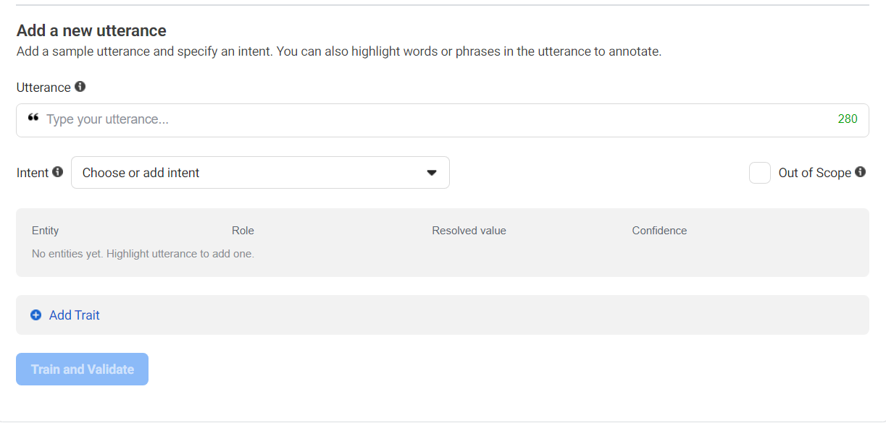
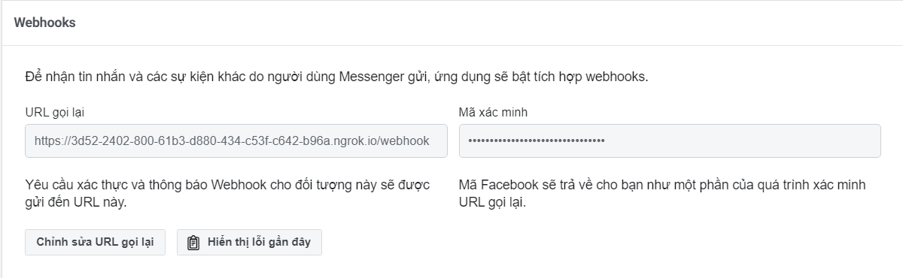
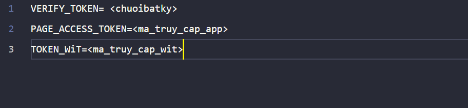
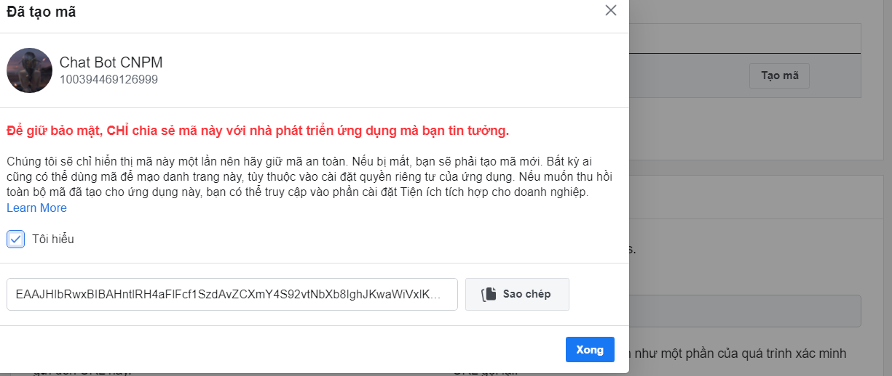
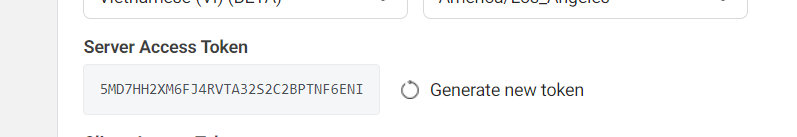

# Sử dụng SDK của Facebook để dựng chat bot phân tích và trả lời tự động, sử dụng làm tổng đài chăm sóc khách hàng của một trang web

## Yêu cầu

-   Cài đặt NodeJS
-   Một tài khoản Facebook
-   Trang Facebook (để nhúng bot này)

## Sử dụng
```
    npm i express node-wit 
```
Tạo một ứng dụng wit và hướng dẫn cho nó hiểu câu nói của bạn
 hãy dạy nó thật nhiều để nó có thể đưa ra các lựa chọn đúng nhất

Triển khai mã muồn này lên ứng dụng Heroku của bạn
Đi tới Ứng dụng dành cho [nhà phát triển Facebook](https://developers.facebook.com/apps/),tạo một app, thêm Sản phẩm Messenger, định cấu hình webhook, (mặc định, url cho webhook là: <liên_kết_herokuapp> / webhook)
    
Cập nhật biến cấu hình 
    
    ```VERIFY_TOKEN=<ma_xac_minh_webhook>```
    ```PAGE_ACCESS_TOKEN=<token_page>```
    
    ```TOKEN_WiT=<token_wit_ai>```
    
-   **Hãy nhớ cập nhật các biến cấu hình trên Heroku.**
